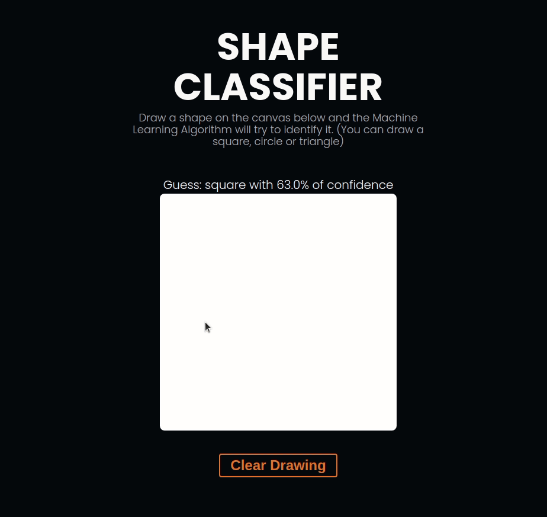

# Shape Classifier

A simple shape classifier website using the ML5.js and P5.js.

  

## [Access website here](https://lnardon.github.io/ShapeClassifier/ "Homepage")

### Info

The model was pretrained by me using 300 sample images of circles, squares and triangles beforehand and then the weights were saved in the /model folder.

### What was used on this project

- ML5.js
- P5.js
- HTML
- JavaScript
- CSS
